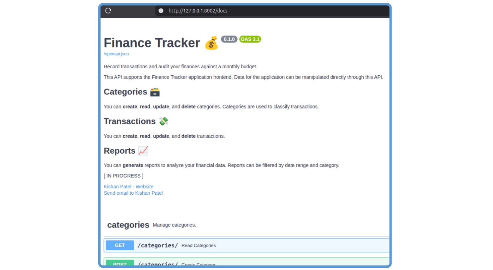

# Finance Tracker

A tool to track transactions against a monthly budget.

Finance Tracker allows you to privately record your transactions and track your financial performance. You can...

- Create and manage categories for your purchases.
- Enter and update transactions.
- Review monthly performance against a set budget for each category.
- Access data via an API and a graphical UI.


## Installation

Requirements:

- Python 3.13+
- [Docker](https://docs.docker.com/engine/install/)

### Get Code

```bash
git clone https://github.com/kishanpatel789/finance_tracker.git
cd finance_tracker
```

### Configure App
Use the template to create a `.env` file. Populate the .env file with a username, password, and database name for the backend Postgres database.

```bash
cp .env.prod.template .env
```

### Build and Start Docker Containers
In the project root, execute the Docker command to start the application:

```bash
docker compose up -d
```

This will build three images. Then three containers will be created and started:

1. **Postgres database**: accessible locally on port 8001
2. **FastAPI application**: accessible locally on port 8002
3. **NiceGUI application**: accessible locally on port 8003

If any of the ports are already in use on your machine, you can change the port mapping in the file `compose.yaml`.

## Usage

All data is stored in a Postgres database. CRUD operations can be accomplished via an API or a graphical UI. See below for specific details.

### API with FastAPI

The API can be reached at `http://127.0.0.1:8002`. Access the OpenAPI docs at `http://127.0.0.1:8002/docs`.



The API docs give detail on each route, their required schema, and the expected output. Typical CRUD operations can be performed on transactions and categories. There's also a route that returns a summary of monthly performance.

### GUI with NiceGUI

The graphical user interface is built with NiceGUI and depends on the backend FastAPI app.

Access the UI at `http://127.0.0.1:8003`.

There are three pages:

1. **Home**: View reports summarizing transactions against budget by month.
2. **Transactions**: Create and manage transactions. Search transactions by date range, vendor, notes, and category.
3. **Categories**: Create and manage categories. Each category can have a monthly budget.


## Architecture

Finance Tracker is built with privacy first. All data is stored in the Postgres database, which means the data stays wherever you host the database container. The API interacts with the database, and the NiceGUI app engages with the database via the API.

The UI is designed for day-to-day management of transactions. For bulk updates or programmatic management, the API can be called directly.


## Contributing

Pull requests are welcome. For major changes, please open an issue first to discuss what you would like to change.

Please make sure to update tests as appropriate.

## License

[MIT](https://choosealicense.com/licenses/mit/)
